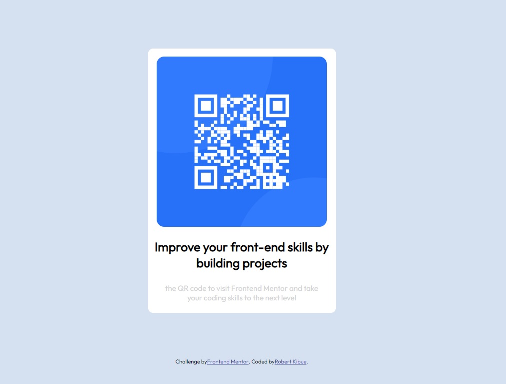

# Frontend Mentor - QR code component solution

This is a solution to the [QR code component challenge on Frontend Mentor](https://www.frontendmentor.io/challenges/qr-code-component-iux_sIO_H). Frontend Mentor challenges help you improve your coding skills by building realistic projects. 

## Table of contents

- [Overview](#overview)
  - [Screenshot](#screenshot)
  - [Links](#links)
- [My process](#my-process)
  - [Built with](#built-with)
  - [What I learned](#what-i-learned)
  - [Continued development](#continued-development)
- [Author](#author)
- [Acknowledgments](#acknowledgments)

## Overview
This exercise was to create a QR code card using only HTML and CSS. 
### Screenshot

### Links

- Solution URL: [Github Repo](https://github.com/Robert-Thaiyah/QR-code-component)
- Live Site URL: [Add live site URL here](https://your-live-site-url.com)

## My process
I took my time to practise using divs and learn how to arrange them properly in a sequence that can be easily readable and css added to the relevant parts.
### Built with

- Semantic HTML5 markup
- CSS custom properties
- Flexbox

### What I learned

Div Heirachy matters alot as a single error in div creation can cause havock in the entire HTML and CSS structure.

### Continued development

Daily perfection is the key to let the content stick and improve on my practise on HTML and CSS.

## Author

- Website - [Robert KIbue](https://github.com/Robert-Thaiyah)
- Frontend Mentor - [@yourusername](https://www.frontendmentor.io/profile/yourusername)

## Acknowledgments

These free projects are helping me learn HTML and CSS through continuous practise and I am happy to have joined the website. 

